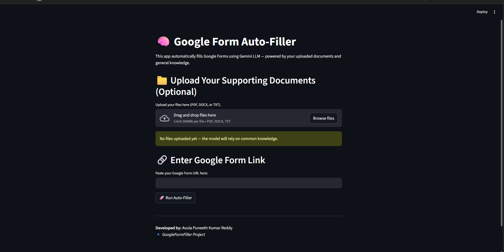

# 🧠 AI-Powered Google Form Auto-Filler


An intelligent automation system that **reads your documents, understands context using RAG, and automatically fills Google Forms** using **Google Gemini + Selenium**.

---

## 🚀 What This Project Does

1. 📄 Reads resumes / documents (PDF, DOCX, TXT)
2. 🧠 Retrieves relevant context using **FAISS + LangChain**
3. 🤖 Generates accurate answers using **Gemini 2.5 Flash**
4. 🕷️ Scrapes Google Form questions
5. 🖱️ Automatically fills the form in a real browser

---

## 📸 Demo

### 1. Streamlit Web Interface


### 2. Upload Resume & Enter Form URL


### 3. AI-Generated Answers (RAG Output)


### 4. Sample Google Form (Before Filling)


### 4. Selenium Auto-Filling the Form


---

## ✨ Key Features

- 📄 **Document-Aware AI** (RAG-based)
- 🤖 **Gemini 2.5 Flash** powered answers
- 🧠 **Context-safe answering** — returns `DATA_NOT_FOUND` if info is missing
- 🕷️ **Google Form Scraping**
- 🖱️ **Selenium Browser Automation**
- 🖥️ **Streamlit UI + CLI Support**

---

## 🛠️ Tech Stack

| Component  | Technology                    |
|------------|-------------------------------|
| LLM        | Google Gemini 2.5 Flash       |
| RAG        | LangChain + FAISS             |
| Embeddings | HuggingFace `instructor-base` |
| Automation | Selenium + WebDriver Manager  |
| Frontend   | Streamlit                     |
| Language   | Python 3.10+                  |

---

## 🚀 Installation & Setup

### 1️⃣ Clone Repository

```bash
git clone https://github.com/Kesanisaicharan/GForm_Filler.git
cd GForm_Filler
```

### 2️⃣ Create Virtual Environment

```bash
python -m venv venv
# Windows
venv\Scripts\activate
# Mac / Linux
source venv/bin/activate
```

### 3️⃣ Install Dependencies

```bash
pip install -r requirements.txt
```

### 4️⃣ Set Environment Variable

Create a `.env` file:

```
GFF_key=YOUR_GEMINI_API_KEY
```

Get your key from **[Google AI Studio](https://aistudio.google.com/)**.

---

## 💻 Usage

### ✅ Option A: Streamlit Web App (Recommended)

```bash
streamlit run app.py
```

Steps:
1. Upload your resume / documents
2. Paste the Google Form URL
3. Click **Run Auto-Filler**
4. Watch the browser fill the form automatically

### 🧪 Option B: CLI Mode

```bash
python main.py
```

---

## 📂 Project Structure

```
GForm_Filler/
│
├── app.py                  # Streamlit Web UI
├── main.py                 # CLI Runner
├── answer_retrever.py      # RAG + Gemini Brain
├── question_retrever.py    # Google Form Scraper
├── form_filler.py          # Selenium Automation
├── requirements.txt
└── README.md
```

---

## ⚠️ Requirements & Limitations

- **Google Chrome** is required
- **Supported:** Short Answers, Paragraphs, MCQs, Checkboxes, Dropdowns
- **Not supported:** Login-required or multi-page logic forms
